# 玩安卓app开源项目
玩安卓开源项目,动态主题,丝滑切换
## 开发环境
- Android studio: Dolphin | 2021.3 RC 1
- Gradle Version:7.5.1
- 开发语言: kotlin,java

## 项目结构
- 项目采用组件化方式,使用MVVM + AndroidX + jetpack组件为基本架构进行开发
- 项目采用VERSION_CATALOG方式统一依赖

## 运行视频
https://github.com/PPQingZhao/WanAndroid-kotlin/issues/1#issue-1938701130

## 运行截图

### --默认主题:
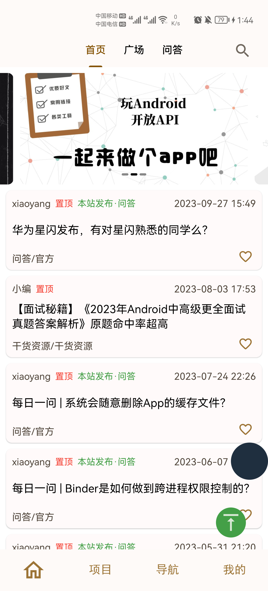 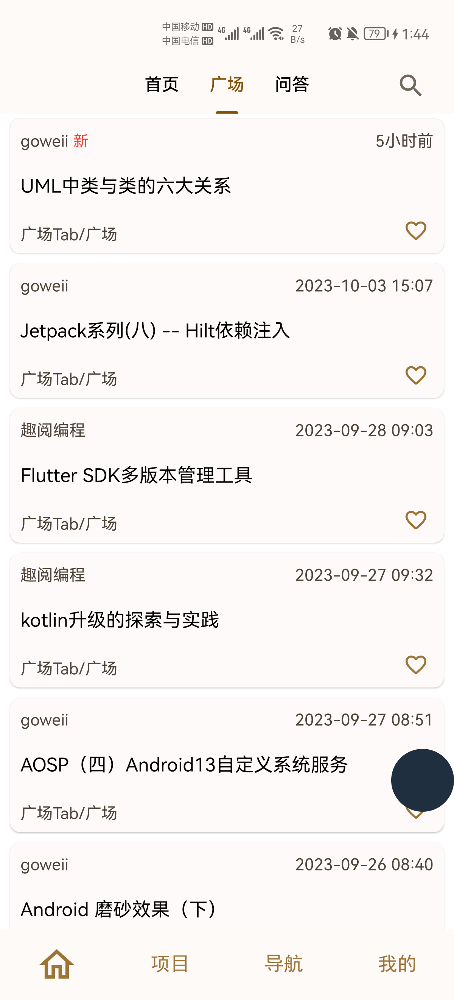 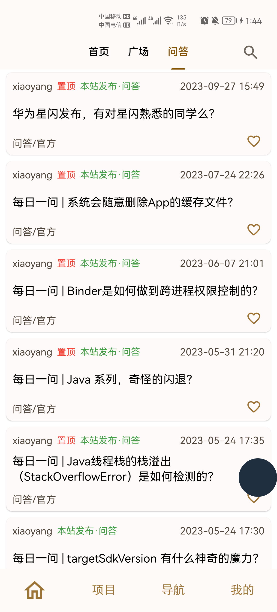

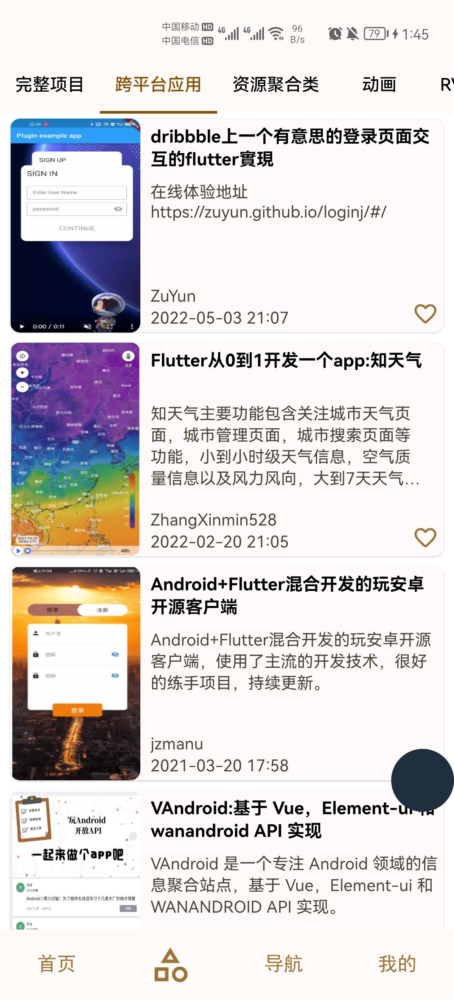 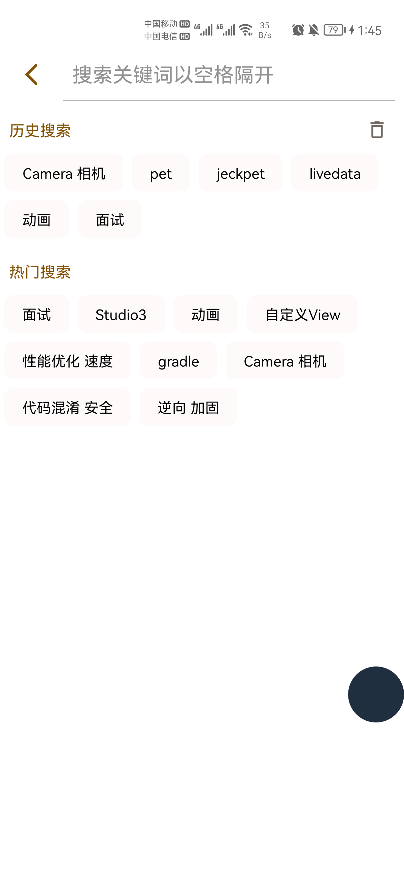 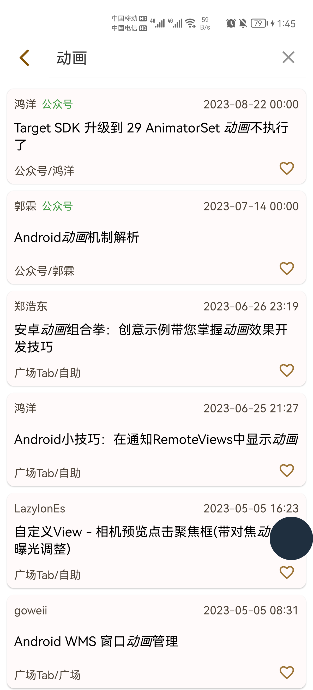

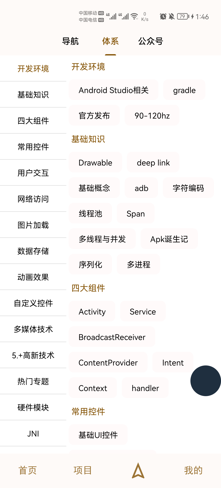 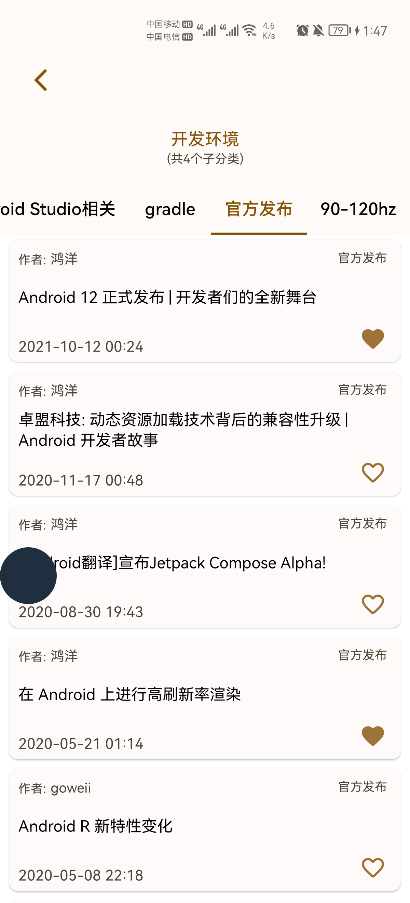 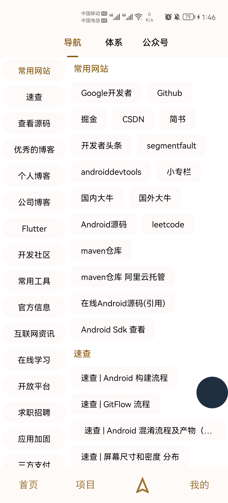 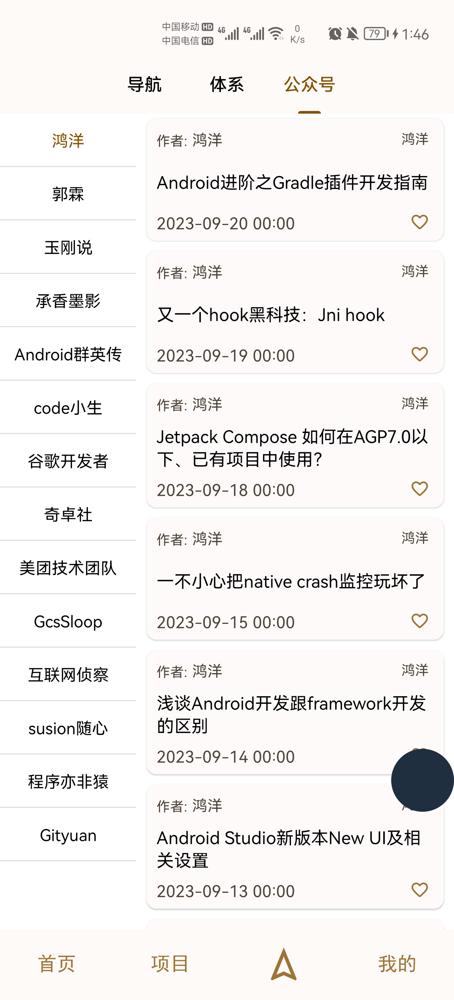

 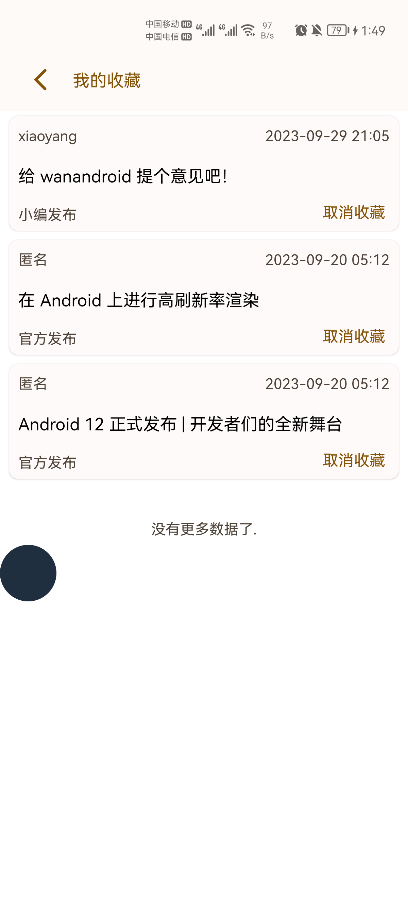 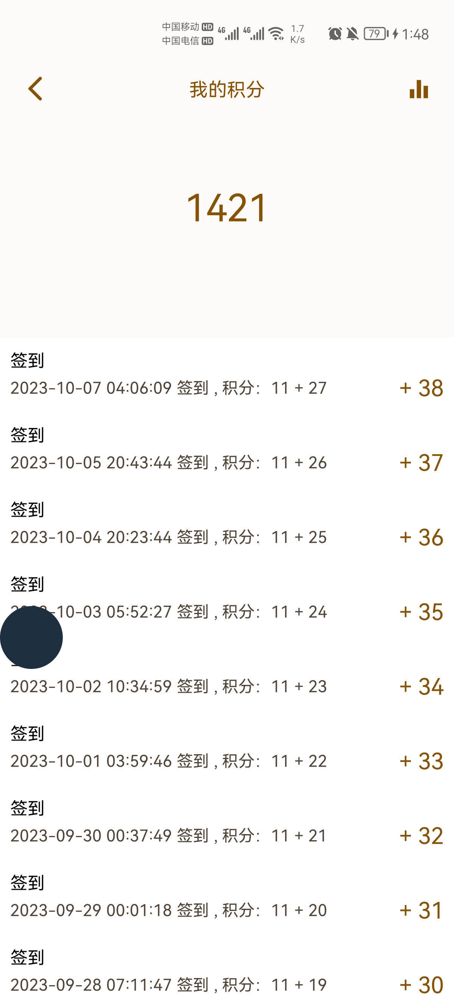

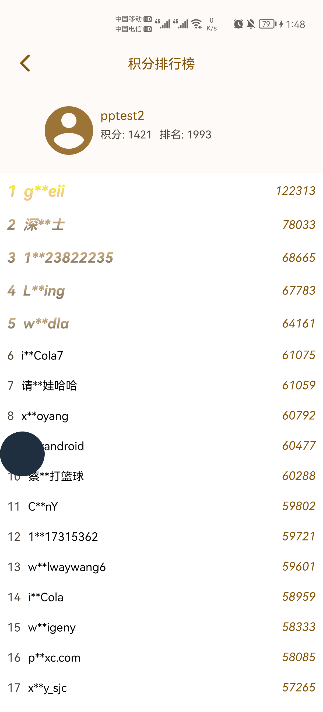 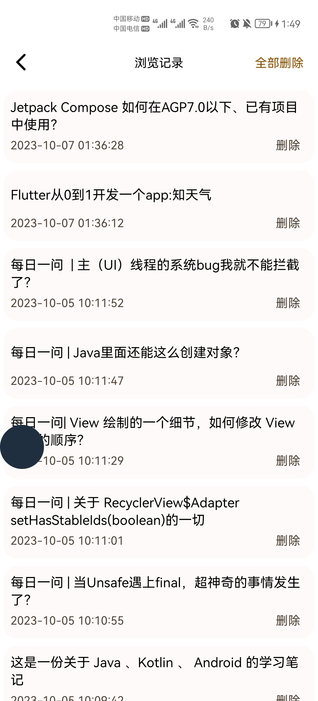 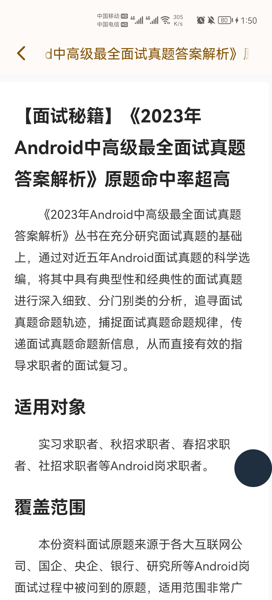

