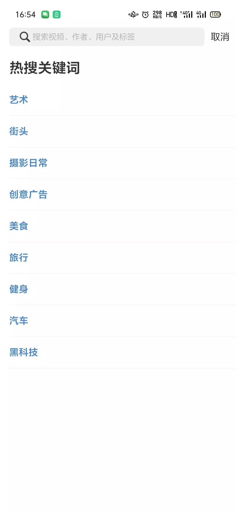
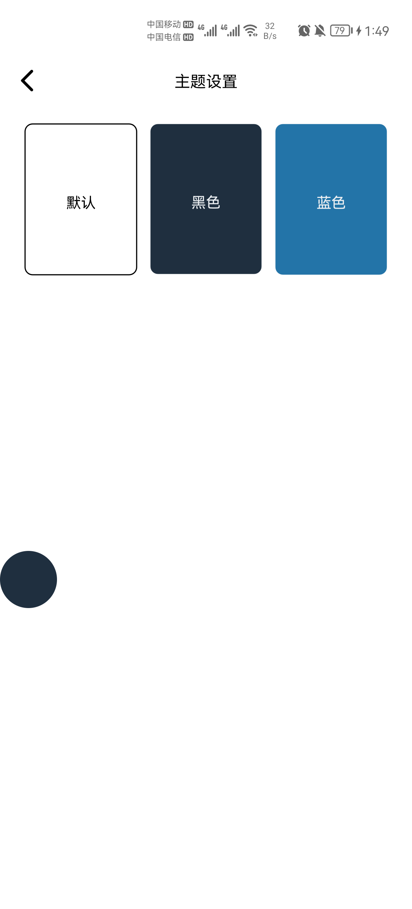

# 玩安卓app开源项目
玩安卓开源项目,动态主题,丝滑切换
## 开发环境
- Android studio: Dolphin | 2021.3 RC 1
- Gradle Version:7.5.1
- 开发语言: kotlin,java

## 项目结构
- 项目采用组件化方式,使用MVVM + AndroidX + jetpack组件为基本架构进行开发
- 项目采用VERSION_CATALOG方式统一依赖

运行截图在项目文件夹 screen

